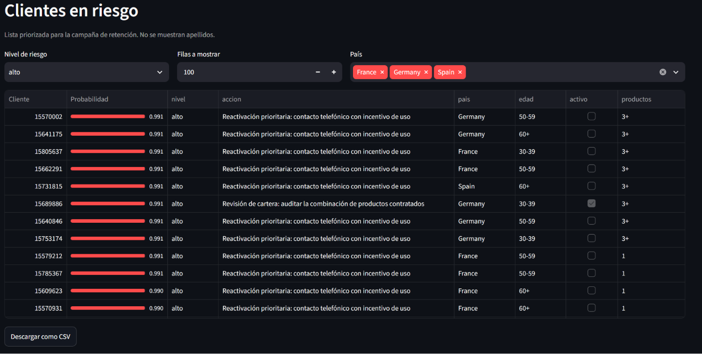
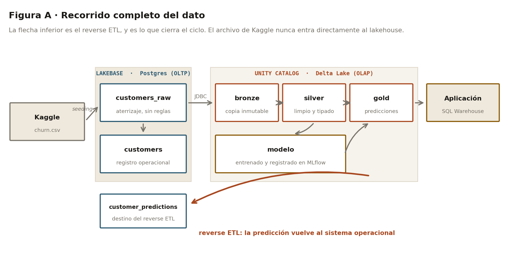
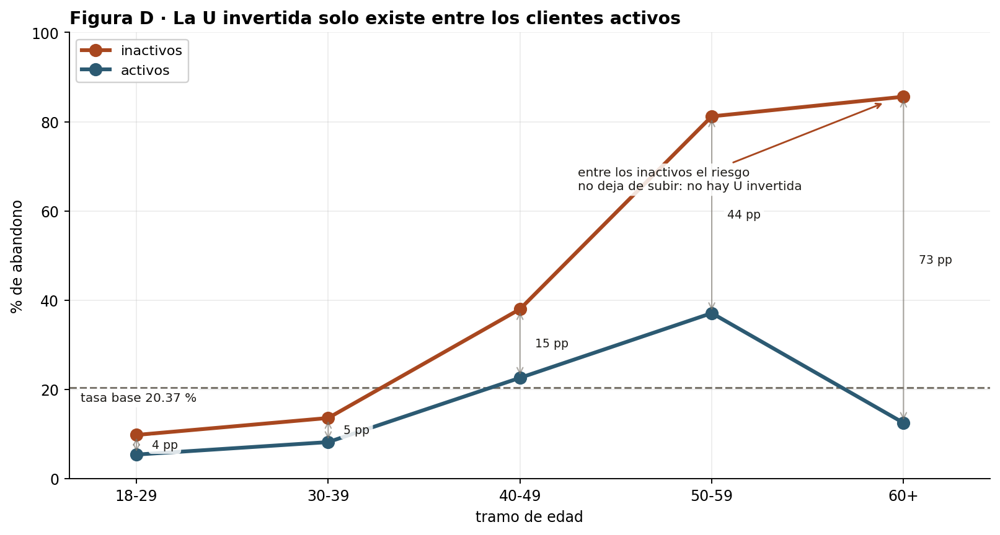
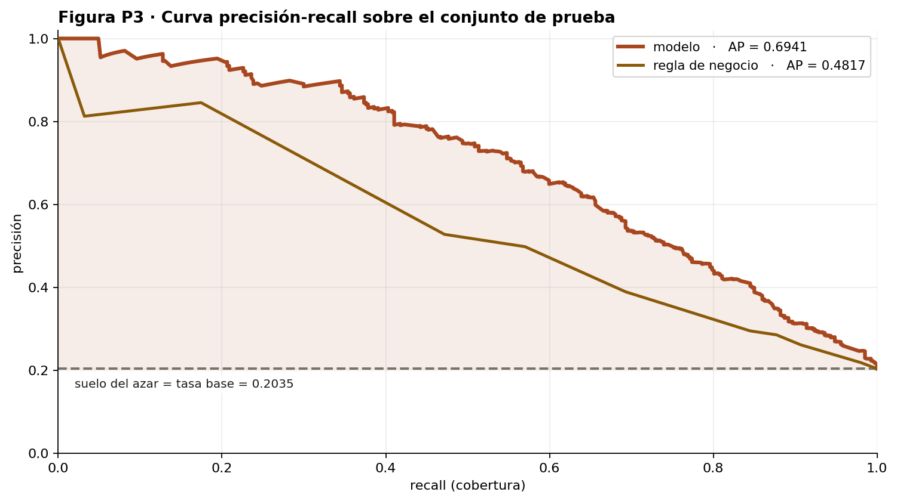
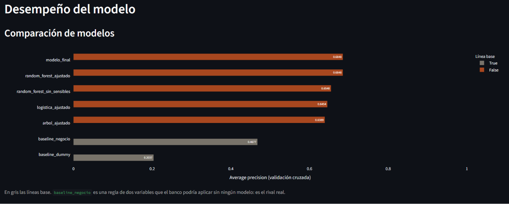
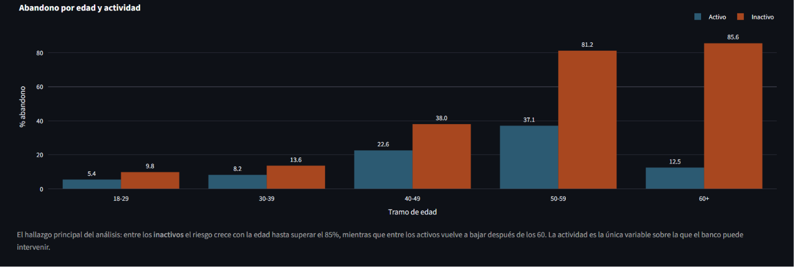

# Predicción de abandono de clientes bancarios

Sistema completo de predicción de fuga sobre Databricks: base operacional, arquitectura
medallion, modelo calibrado y aplicación de retención en producción.



Esto es lo que produce el sistema: una lista ordenada por probabilidad, con acción sugerida
y sin apellidos. Todo lo demás existe para que esta pantalla tenga sentido.

## El problema

Un banco con 10.000 clientes pierde al 20,4 % al año. Puede llamar a 800 antes de que se
vayan. La pregunta no es *quién se va a ir* —eso no lo decide nadie— sino **a quién llamar
con las 800 llamadas que hay**.

Esa restricción cambia el problema entero. Rescatar a un cliente vale 145 €, molestar a uno
que se iba a quedar cuesta 35 €. De ahí sale el umbral de rentabilidad:

```
p* = 35 / (145 + 35) = 0,194
```

Por debajo de esa probabilidad, llamar destruye valor. Pero con capacidad fija el umbral
real no lo fija la rentabilidad sino el cupo: entran los 800 de mayor riesgo, y eso empuja
el corte hasta 0,726. **La capacidad convierte una tarea de clasificación en una de
ordenación**, y por eso la métrica que decide es la precisión media y no la exactitud.

## La arquitectura



Dos sistemas con trabajos distintos. Lakebase es el lado operacional —filas individuales,
claves foráneas, latencia baja— y Delta el analítico —columnas, historial, escaneos
grandes—. La flecha inferior es el **reverse ETL**, y es lo que cierra el ciclo: sin ella
las predicciones se quedan en un almacén que nadie consulta a diario.

La frontera entre ambas capas es también el control anti-fuga. La ingeniería de
características ocurre en silver, después de haber apartado el conjunto de prueba.

## El hallazgo que dirigió el modelado



El riesgo no crece con la edad: crece con la edad **entre los inactivos**, hasta el 85,6 %
en los mayores de 60, mientras que entre los activos vuelve a bajar después de esa edad.

Esa interacción es la razón de que un modelo lineal se quede corto y de que el árbol la
descubra sola en su segundo nivel. Y es accionable, que es lo que importa: la actividad es
la única de las dos variables sobre la que el banco puede intervenir.

## Resultados



Medido sobre el conjunto de prueba apartado antes de entrenar.

| | Modelo | Regla de negocio |
|---|---|---|
| Precisión media (validación cruzada) | **0,6848** | 0,4677 |
| ROC-AUC | 0,8586 | — |
| Precisión con 160 contactos | **88,1 %** | — |
| Abandonos captados | 141 de 407 | — |

La comparación que importa no es contra el azar, es **contra la regla que el banco podría
aplicar mañana sin ningún modelo** (mayores de 50 e inactivos). Ese es el rival real.

### Un criterio pre-registrado que no se cumplió

Se exigía una exhaustividad de 0,60. No se alcanzó, y al investigar por qué apareció algo
más interesante que un mal resultado: **era inalcanzable desde el principio**.

```
techo = 160 contactos / 407 abandonos = 0,393
```

Con capacidad limitada no se puede rescatar más del 39,3 % aunque el modelo sea perfecto.
Se alcanzó 0,344 — el **87,5 % de ese techo**. El criterio no se retocó para que pasara: se
reporta como incumplido y se explica por qué era imposible.

## La aplicación



Cinco secciones: resumen ejecutivo con la comprobación de calibración a la vista,
segmentación con filtros, lista priorizada, desempeño del modelo y predicción individual.



El hallazgo del análisis no se queda en un notebook: aparece donde el negocio lo consulta,
con los filtros de país, edad y actividad afectando a la vez a los tres gráficos.

Corre como su propio principal de servicio con tres concesiones —uso de catálogo, uso de
esquema y lectura sobre gold— y **no toca bronze ni silver**. Mínimo privilegio: si algún
día se compromete, el alcance es una tabla de predicciones que ya estaba en el CRM.

## Estructura

```
code/
├── notebooks/
│   ├── 00_definicion_problema.ipynb   Métricas, modelo de costes, criterios pre-registrados
│   ├── 01_ingesta_bd_nube.ipynb       Descarga, carga a Lakebase, bronze
│   ├── 02_preparacion_datos.ipynb     Silver, features, apartado del conjunto de prueba
│   ├── 03_eda_analisis.ipynb          Exploración y contrastes
│   ├── 04_modelado.ipynb              Tres familias, validación cruzada, auditoría P1–P5
│   ├── 05_evaluacion.ipynb            Test, calibración, coste de las variables sensibles
│   ├── 06_publicacion_gold.ipynb      Gold, registro en Unity Catalog, reverse ETL
│   ├── setup_entorno.ipynb            Preparación del entorno
│   └── demo/                          Notebooks didácticos, sin dependencia de datos
├── sql/                               Esquema Lakebase, permisos y desmontaje
└── app/                               Aplicación Streamlit desplegada en Databricks Apps
```

Los notebooks van numerados en el orden en que se ejecutan. Los de `demo/` están fuera de
esa secuencia a propósito: explican conceptos y no forman parte del flujo.

## Decisiones que vale la pena mirar

**Los criterios se fijaron antes de entrenar.** Cinco predicciones sobre qué haría el
modelo, escritas en el notebook 00 y auditadas en el 04. Cuatro se confirmaron; una salió
parcial y se reporta parcial.

**El modelo desplegado no usa `gender`.** Se midió lo que costaba excluirla: 0,12 puntos de
exhaustividad, unos dos clientes. No justifica usar una característica protegida para
repartir un beneficio.

**Está calibrado.** Sin calibración isotónica, `class_weight="balanced_subsample"` deja
probabilidades infladas. Una probabilidad que no se puede leer como probabilidad no sirve
para decidir a quién llamar.

## Reproducir

Requiere una cuenta de Databricks con Lakebase habilitado. El orden:

1. `code/sql/01_landing.sql` — esquema y tabla de aterrizaje en Lakebase
2. `00` → `01` → `02` → `03` → `04` → `05` → `06` en Databricks
3. `code/sql/03_grants_app.sql` — permisos, sustituyendo el identificador del principal
4. Desplegar `code/app/` como Databricks App con un SQL Warehouse asociado

`code/sql/00_teardown.sql` deja el entorno limpio para empezar de cero. El `DROP` viene
comentado a propósito.

Los datos son el conjunto público de abandono bancario; el notebook 01 lo descarga y
registra su hash. No se versiona aquí.

## Limitaciones

**Los datos son sintéticos.** Salario uniforme con curtosis −1,18, ningún atípico posible
por construcción, un mínimo de 11,58 exactamente donde tocaba. Cuatro pruebas
independientes. Eso pone un techo a lo que se puede aprender: las interacciones que existen
son las que el generador introdujo.

**Al modelo se le escapan los jóvenes.** Detecta bien el abandono de clientes mayores e
inactivos, que es donde está la señal. Fuera de ahí, menos.

**Sin datos temporales** no hay forma de validar contra deriva. El conjunto es una foto.

## Stack

Databricks (Lakebase Postgres 17, Unity Catalog, Delta Lake, MLflow, Apps) ·
Python (scikit-learn, pandas, PySpark) · Streamlit · Plotly

## Licencia

MIT
